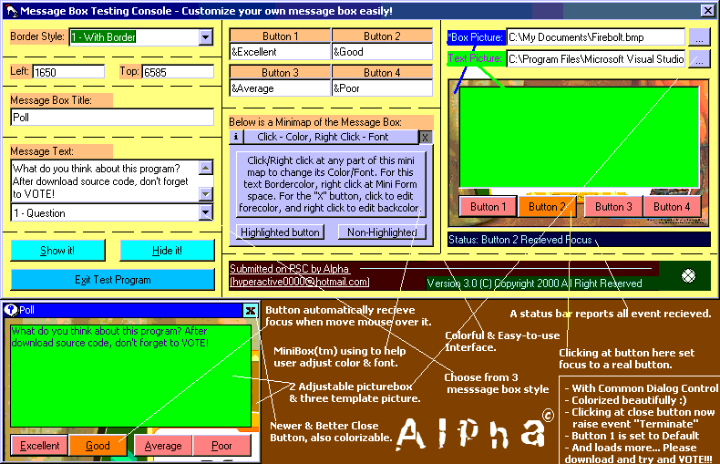



## _-! Customizable Message Box !-_ A MUST-SEE Active X: *3rd Update!* Close btn, Picturing, Auto-Focus by Alph@!

### Description

This UserControl Generate a Message Box that you can customize every detail of it. This is a 3rd update! Increase customizing performance, so you can adjust its... Title Bar Color & Font, Message Text Color & Font, Title Caption, Message Text, 4 Buttons Text, Button Highlight & Lowlight Color, Close Button Color & Back Color, Icon Back Color, Border Color, Border Style, Message Box Back Picture, Text Area Picture, and Message Box Back Color. Button now automatically recieve focus if you move your mouse over them, and the highlight color will be set to that button. Button also invisible if you don't set any caption data into it. If you think the desing is ugly can download it and customize yourself. In this version you also can insert picture in Message Box, and also another one as a background at text area. The screen shot is uglier that its real picture because this's .gif image. License problem is fixed so you shouldn't have problem with Regsve32 anymore. Old ugly close button now replaced with a better one. Please VOTE for me and leave comments. Good, bad, are strongly appreciate. Anyone who want to develop this with me just send an e-mail to hyperactive0000@hotmail.com . Note: if you know how to play windows sound (set by user) like when you click Start menu or Minimize program, please tell me so I can put it in this code. Anyway, in this version, if you launch a message box, it also generate "Beep" Sound. Console Panel now very cool and so colorful, but you won't see it in screenshot. Now have method "SetBtnFocus" so you can set highlight to any button. 3 screen picture are add as template picture to put it in message box. Every time button recieve focus it generate event seperately. Console now have status bar to inform when any event has been raised. All properties is run-time customizable. Was it buggy? well, not in this version (3.2 R17) anymore.

The most important thing, don't forget to *V*O*T*E* for my code.
 
### More Info
 
It needs a lot of properties. But even you don't set one, it still look good in my opinion.

All bug seem to be fixed

It returns an amazing, beautifully colorized Message Box.

No any side effect you should beware, it wonn't take over Windows's one!

### API Declarations

No any API needed in this amazing, wonderful code!
